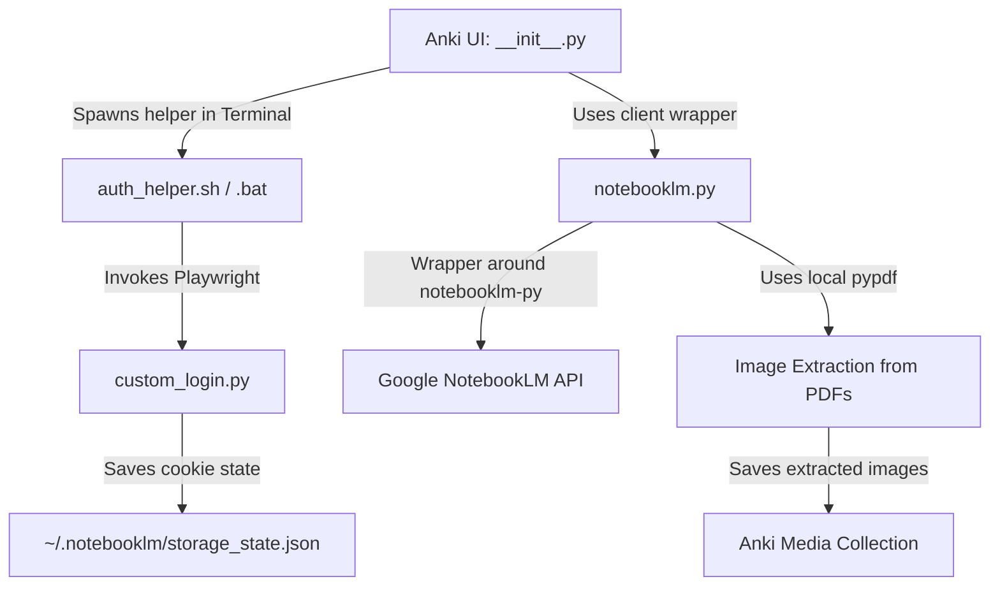

# 🚀 Resume Instructions: NotebookLM Flashcard Generator

This document provides a complete guide for the user and any AI coding assistant to resume development of the **NotebookLM Flashcard Generator** Anki addon after transitioning to the new Linux distribution.

---

## 📅 Part 1: Quick Recovery on the New Distro (Step-by-Step)

Follow these exact steps once you are booted into your new Linux distribution:

### 1. Install System Dependencies
Install Python 3, pip, git, and a terminal emulator.
* **Ubuntu/Debian/Mint/Pop!_OS**:
  ```bash
  sudo apt update
  sudo apt install git python3 python3-pip python3-venv brave-browser
  ```
* **Arch Linux / EndeavourOS**:
  ```bash
  sudo pacman -Syu git python python-pip brave-bin
  ```
* **Fedora**:
  ```bash
  sudo dnf install git python3 python3-pip brave-browser
  ```

### 2. Restore Your Login Session (No Re-authentication needed!)
Your active login session cookies have been backed up as [storage_state_backup.json](file:///mnt/Beta/App/storage_state_backup.json). Restore it to your new home directory:
```bash
mkdir -p ~/.notebooklm
cp /mnt/Beta/App/storage_state_backup.json ~/.notebooklm/storage_state.json
```

### 3. Re-install Python Dependencies
Ensure the required libraries are downloaded into the repository's local `libs/` folder:
```bash
cd /mnt/Beta/App
pip install pypdf notebooklm-py --target=libs/ --upgrade
```

### 4. Deploy the Addon to Anki
Install Anki on your system, launch it once to initialize directories, then close it. Run the local sync script:
```bash
chmod +x update_local_anki.sh
./update_local_anki.sh
```
*Note: If you are using the Flatpak version of Anki, check the path in `update_local_anki.sh` and make sure it targets your Flatpak directory (usually `~/.var/app/net.ankiweb.Anki/data/Anki2/addons21/notebooklm-flashcard-generator/`).*

---

## 🛠️ Part 2: Architecture & Recent Fixes

Here is the codebase architecture so you can quickly get back up to speed:



### Key Files Map
* [__init__.py](file:///mnt/Beta/App/__init__.py): Standard Anki Addon entrypoint. Contains dialog layout, worker thread management, terminal emulator sanitization (removes `PYTHON*`/`QT_*`/`LD_LIBRARY_PATH` to prevent conflicts), and card ingestion.
* [notebooklm.py](file:///mnt/Beta/App/notebooklm.py): Interacts with the NotebookLM API client and handles the background PDF page image extraction.
* [custom_login.py](file:///mnt/Beta/App/custom_login.py): Script executed by the auth helper to open a browser window and capture cookies. Supports multi-browser detection (Brave, Chrome, Firefox, etc.).
* [prompt_manager.py](file:///mnt/Beta/App/prompt_manager.py): Manage Prompts dialog box GUI. Allows adding/editing/deleting custom prompts.
* [auth_helper.sh](file:///mnt/Beta/App/auth_helper.sh): The terminal-based setup/login script. Runs in the user's terminal emulator.
* [update_local_anki.sh](file:///mnt/Beta/App/update_local_anki.sh): The developer script that copies files directly into Anki's addon directory for live testing.

### Crucial Fixes Implemented Recently:
1. **Linux Terminal Crash Fix**: When launching the terminal helper from Anki on Linux, the Qt/Python libraries loaded by Anki clashed with system libraries. We fixed this by popping environment variables (`LD_LIBRARY_PATH`, `PYTHON*`, `QT_*`) before invoking the child process.
2. **Persistent State Storage**: Moved `storage_state.json` and local libraries from the addon directory to `~/.notebooklm/` so they survive addon updates without forcing the user to log in again.
3. **Prompt Manager UI freeze**: Fixed selectable list item properties and added dynamic dropdown refreshing on closing the Prompt Manager dialog.

---

## 📝 Part 3: Message to the AI Coding Assistant

Hello! When you resume this task on the new distro, please read the following checklist:

1. **Verify environment**:
   * Check if `~/.notebooklm/storage_state.json` exists.
   * Run `python3 -c "import sys; sys.path.insert(0, 'libs'); import pypdf; import notebooklm"` to confirm python dependencies can load successfully.
2. **Verify Anki integration**:
   * Open Anki, open the **NotebookLM Flashcard Generator** dialog.
   * Verify that the prompt dropdown lists all templates (e.g. "Default", "High-Yield", "Image/Diagram Flashcards").
   * Click **Manage Prompts**, make sure you can edit/save prompts, and that the dropdown updates instantly when you close the manager.
3. **Test Image Extraction**:
   * Load a PDF with diagrams/images.
   * Use the **Image/Diagram Flashcards** prompt.
   * Check if cards generated contain the prepended images and are imported successfully into Anki.

### Proposed Next Tasks:
* **Selective image extraction UI**: Let the user preview and select which extracted images to attach to the front/back of the generated card instead of prepending all images from that page automatically.
* **Fallback to cloud parsing**: If local `pypdf` extraction fails or finds no images, offer alternative extraction methods.
* **Auto-Updater UI**: Add a small button in the Addon settings to check GitHub releases and trigger in-place updating of the code.
